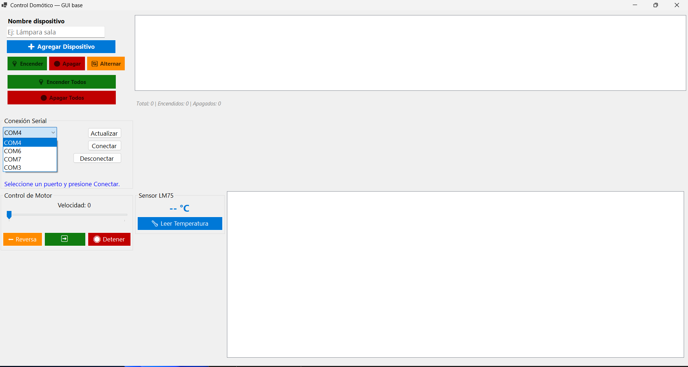
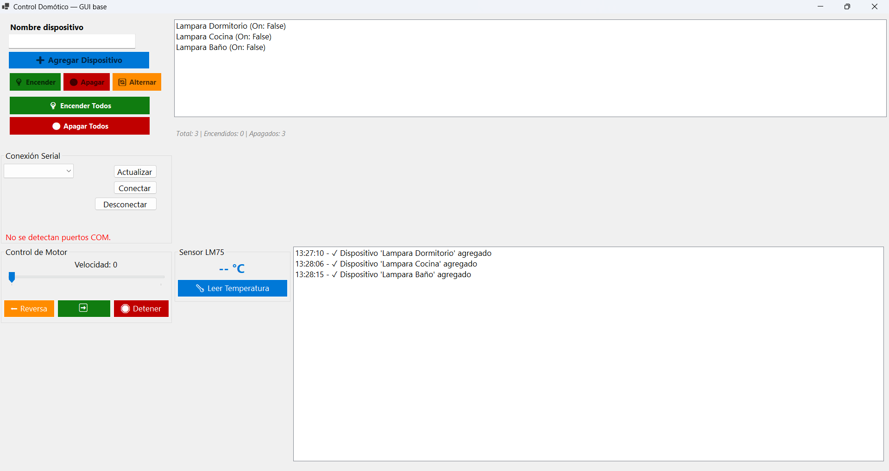
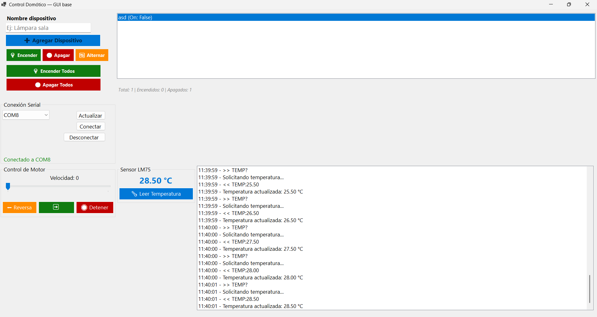
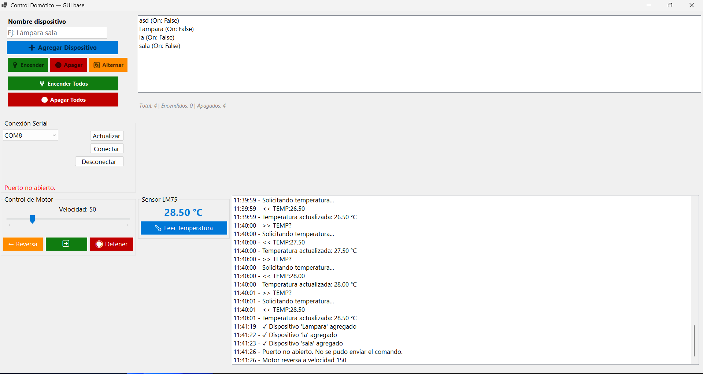

# Sistema de Control Domótico ESP32 + C#

[](https://dotnet.microsoft.com/)
[](https://www.espressif.com/)
[](https://www.microsoft.com/windows)
[](LICENSE)

Sistema de automatización domótica que permite el control remoto de dispositivos electrónicos mediante comunicación serial entre una aplicación Windows Forms (C#) y un microcontrolador ESP32.


*Interfaz principal del sistema (captura pendiente)*

---

## 🎯 Características Principales

- 🔌 **Comunicación Serial** bidireccional a 115200 bps
- 💡 **Control de LEDs** mediante GPIO del ESP32
- 🔄 **Control de Motor DC** con velocidad y dirección (L298N)
- 🌡️ **Sensor de Temperatura** LM75 por protocolo I2C
- 📝 **Log en Tiempo Real** con timestamps
- 🖥️ **Interfaz Gráfica** intuitiva en Windows Forms
- ⚡ **Gestión de Dispositivos** virtuales (crear, listar, controlar)

---

## 📋 Tabla de Contenidos

- [Demostración](#-demostración)
- [Arquitectura](#-arquitectura)
- [Tecnologías](#-tecnologías)
- [Hardware Requerido](#-hardware-requerido)
- [Instalación](#-instalación)
- [Uso](#-uso)
- [Protocolo de Comunicación](#-protocolo-de-comunicación)
- [Documentación](#-documentación)
- [Capturas](#-capturas)
- [Estructura del Proyecto](#-estructura-del-proyecto)
- [Pruebas](#-pruebas)
- [Licencia](#-licencia)
- [Autor](#-autor)

---

## 🎬 Demostración

### Funcionalidades en Acción

| Característica | Descripción |
|----------------|-------------|
| **Gestión de Dispositivos** | Agregar, listar y controlar múltiples dispositivos virtuales |
| **Control de LED** | Encendido/apagado con confirmación en tiempo real |
| **Control de Motor** | Velocidad ajustable (-255 a 255) y dirección bidireccional |
| **Lectura de Temperatura** | Sensor LM75 con precisión de 0.5°C |
| **Log Completo** | Registro de todos los comandos y respuestas |

> Ver más capturas en la carpeta [Documentacion/Capturas](Documentacion/Capturas/)

---

## 🏗️ Arquitectura

```
┌─────────────────────────────────────────────────────────────┐
│                  CAPA DE PRESENTACIÓN                       │
│              Windows Forms (C# .NET 8.0)                    │
└──────────────────────┬──────────────────────────────────────┘
                       │
┌──────────────────────▼──────────────────────────────────────┐
│                    CAPA DE LÓGICA                           │
│     Domain: IActuable, DispositivoBase, Lampara             │
│              ControladorDomotico                            │
└──────────────────────┬──────────────────────────────────────┘
                       │
┌──────────────────────▼──────────────────────────────────────┐
│                CAPA DE COMUNICACIÓN                         │
│           SerialPort (115200 bps, N, 8, 1)                  │
└──────────────────────┬──────────────────────────────────────┘
                       │ USB Serial
┌──────────────────────▼──────────────────────────────────────┐
│                   CAPA DE HARDWARE                          │
│              ESP32 DevKit V1 + PlatformIO                   │
└──────────────────────┬──────────────────────────────────────┘
                       │
┌──────────────────────▼──────────────────────────────────────┐
│                DISPOSITIVOS FÍSICOS                         │
│    LED (GPIO2) | Motor L298N | Sensor LM75 (I2C)            │
└─────────────────────────────────────────────────────────────┘
```

---

## 🛠️ Tecnologías

### Software

| Componente | Tecnología | Versión |
|------------|-----------|---------|
| **Aplicación Desktop** | C# .NET | 8.0 |
| **Framework GUI** | Windows Forms | .NET 8.0 |
| **IDE PC** | Visual Studio | 2022 |
| **Microcontrolador** | ESP32 DevKit V1 | - |
| **IDE Embebido** | PlatformIO | VSCode |
| **Framework ESP32** | Arduino | - |
| **Comunicación** | UART Serial | 115200 bps |

### Librerías

- **System.IO.Ports** - Comunicación serial
- **Windows.Forms** - Interfaz gráfica
- **Wire.h** - Comunicación I2C (Arduino)

---

## 🔌 Hardware Requerido

### Componentes Principales

| Componente | Especificaciones | Cantidad |
|------------|------------------|----------|
| **ESP32 DevKit V1** | 38 pines, dual-core @ 240MHz | 1 |
| **Módulo L298N** | Driver motor DC dual, 2A/canal | 1 |
| **Motor DC** | 6V-12V | 1 |
| **Sensor LM75** | Sensor temperatura I2C | 1 |
| **Cables Jumper** | Macho-Macho | 15 |
| **Cable USB** | Para programación ESP32 | 1 |

### Diagrama de Conexiones

```
ESP32 DevKit V1
├── GPIO2  → LED Integrado
├── GPIO23 → L298N (ENA - PWM)
├── GPIO19 → L298N (IN1)
├── GPIO18 → L298N (IN2)
├── GPIO21 → LM75 (SDA)
└── GPIO22 → LM75 (SCL)
```

> Ver diagrama detallado en [Documentacion/DOCUMENTACION_COMPLETA.md](Documentacion/DOCUMENTACION_COMPLETA.md#5-componentes-de-hardware)

---

## 📦 Instalación

### Requisitos Previos

- **Windows 10/11**
- **Visual Studio Code**
- **.NET 8.0 SDK** ([Descargar](https://dotnet.microsoft.com/download))
- **VSCode + PlatformIO** ([Instalar PlatformIO](https://platformio.org/install/ide?install=vscode))
- **Driver USB-Serial** para ESP32 (CP2102 o CH340)

### Clonar el Repositorio

```bash
git clone https://github.com/TU_USUARIO/ControlDomotico.git
cd ControlDomotico
```

### Configurar Aplicación C#

```bash
cd ControlDomotico
dotnet restore
dotnet build
```

O abrir `ControlDomotico.sln` en Visual Studio 2022.

### Configurar ESP32

```bash
cd ESP32/PlatformIO/Projects/Final
pio run --target upload
```

O usar la interfaz de PlatformIO en VSCode.

---

## 🚀 Uso

### 1. Ejecutar la Aplicación

**Desde Visual Studio**:
- Abrir `ControlDomotico.sln`
- Presionar `F5` o clic en "Iniciar"

**Desde línea de comandos**:
```bash
cd ControlDomotico
dotnet run
```

### 2. Conectar el ESP32

1. Conectar ESP32 por USB
2. Seleccionar puerto COM en la aplicación
3. Hacer clic en **"Conectar"**
4. Verificar mensaje "READY" en el log

### 3. Crear Dispositivos

1. Escribir nombre del dispositivo (ej: "Lámpara Sala")
2. Hacer clic en **"Agregar"**
3. Repetir para crear más dispositivos

### 4. Controlar Dispositivos

- **Encender/Apagar**: Seleccionar dispositivo y usar botones
- **Motor**: Ajustar velocidad con TrackBar, usar Adelante/Reversa/Stop
- **Temperatura**: Hacer clic en "Leer Temperatura"

---

## 📡 Protocolo de Comunicación

### Comandos Principales

| Comando | Parámetro | Respuesta | Descripción |
|---------|-----------|-----------|-------------|
| `LED1:ON` | - | `OK` | Enciende LED |
| `LED1:OFF` | - | `OK` | Apaga LED |
| `M1:SET:<val>` | -255 a 255 | `OK` | Velocidad motor |
| `M1:STOP` | - | `OK` | Detiene motor |
| `TEMP?` | - | `TEMP:<val>` | Lee temperatura |
| `PING` | - | `PONG` | Test conexión |

### Ejemplo de Interacción

```
PC → ESP32: LED1:ON
ESP32 → PC: OK

PC → ESP32: M1:SET:200
ESP32 → PC: OK

PC → ESP32: TEMP?
ESP32 → PC: TEMP:24.50
```

> Documentación completa del protocolo: [PROTOCOLO_COMUNICACION.md](Documentacion/PROTOCOLO_COMUNICACION.md)

---

## 📚 Documentación

La documentación completa del proyecto incluye:

- **[PROTOCOLO_COMUNICACION.md](Documentacion/PROTOCOLO_COMUNICACION.md)** - Especificación completa del protocolo serial
- **[DOCUMENTACION_COMPLETA.md](Documentacion/DOCUMENTACION_COMPLETA.md)** - Documento técnico principal
- **[README.md](Documentacion/README.md)** - Índice de la documentación

### Documentación Técnica

El documento principal incluye:

- ✅ Descripción del sistema y objetivos
- ✅ Arquitectura detallada (4 capas)
- ✅ Componentes de software y hardware
- ✅ Implementación del código
- ✅ 10 casos de prueba documentados
- ✅ Resultados y métricas de rendimiento

---

## 📸 Capturas

### Interfaz Principal


### Control de Dispositivos

| Creación | Control Motor | Temperatura |
|----------|---------------|-------------|
|  |  |  |

### Log de Eventos



> **Nota**: Las capturas se generarán siguiendo la [GUIA_CAPTURAS.md](Documentacion/GUIA_CAPTURAS.md)

---

## 📁 Estructura del Proyecto

```
ControlDomotico/
│
├── ControlDomotico/              # Aplicación Windows Forms
│   ├── Program.cs               # Punto de entrada
│   ├── Domain/                  # Lógica de negocio
│   │   ├── IActuable.cs        # Interfaz de dispositivos
│   │   ├── DispositivoBase.cs  # Clase base abstracta
│   │   ├── Lampara.cs          # Implementación lámpara
│   │   └── ControladorDomotico.cs  # Gestor de dispositivos
│   ├── UI/                      # Interfaz de usuario
│   │   ├── Form1.cs            # Lógica de la interfaz
│   │   ├── Form1.Designer.cs   # Diseño visual
│   │   └── Form1.resx          # Recursos
│   └── ControlDomotico.csproj  # Configuración del proyecto
│
├── ESP32/                       # Firmware ESP32
│   └── PlatformIO/
│       └── Projects/
│           └── Final/
│               ├── platformio.ini  # Configuración PlatformIO
│               └── src/
│                   └── main.cpp    # Código principal ESP32
│
├── Documentacion/               # Documentación técnica
│   ├── PROTOCOLO_COMUNICACION.md
│   ├── DOCUMENTACION_COMPLETA.md
│   └── Capturas/               # Imágenes del sistema
│
├── .gitignore                  # Archivos ignorados por Git
├── LICENSE                     # Licencia del proyecto
└── README.md                   # Este archivo
```

---

## 🧪 Pruebas

El proyecto incluye 10 casos de prueba documentados:

| ID | Tipo | Descripción | Estado |
|----|------|-------------|--------|
| T01 | Unitaria | Agregar dispositivo | ✅ PASS |
| T02 | Unitaria | Evitar duplicados | ✅ PASS |
| T03 | Integración | Conectar puerto serial | ✅ PASS |
| T04 | Integración | Encender LED | ✅ PASS |
| T05 | Integración | Control motor adelante | ✅ PASS |
| T06 | Integración | Control motor reversa | ✅ PASS |
| T07 | Integración | Detener motor | ✅ PASS |
| T08 | Integración | Leer temperatura | ✅ PASS |
| T09 | Sistema | Secuencia completa | ✅ PASS |
| T10 | Estrés | Comandos rápidos | ✅ PASS |

> Ver detalles en [DOCUMENTACION_COMPLETA.md](Documentacion/DOCUMENTACION_COMPLETA.md#8-pruebas-realizadas)
---

## 📄 Licencia

Este proyecto está bajo la Licencia MIT. Ver el archivo [LICENSE](LICENSE) para más detalles.

---

## 👨‍💻 Autor

**Juan** - *Desarrollador Principal*

- GitHub: [@isslypa](https://github.com/isslypa)
---

## 📊 Estado del Proyecto


---